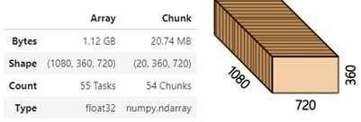
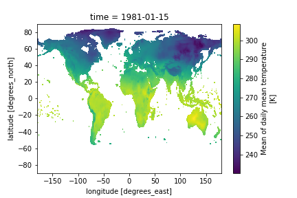
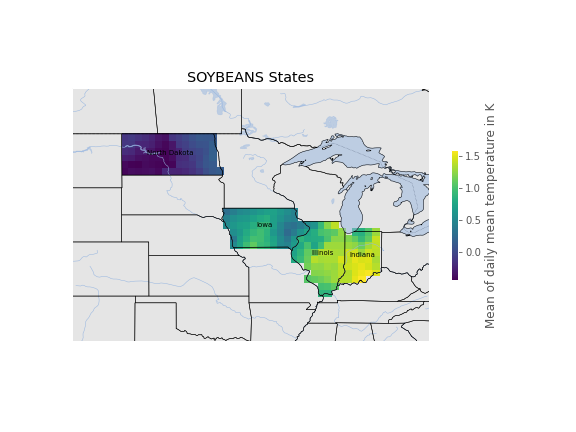
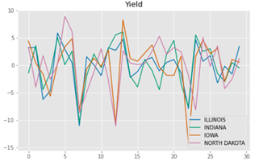
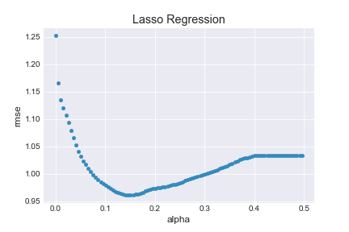
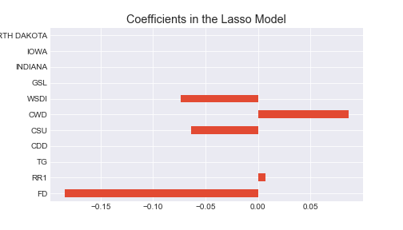
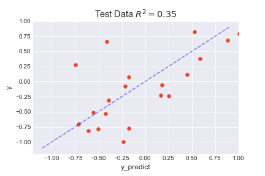
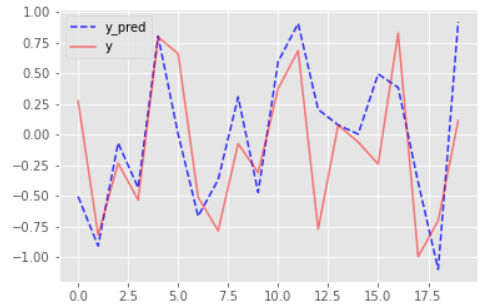

# Crop Yield Prediction Using Machine Learning
## Introduction

While machine learning algorithms has been used in many fields the researchers in weather and climate 
applications have just recently started to take advantage of powerful ML algorithms. One of the interesting 
topics is to predict the crop production yield with the meteorological variables. Although there have been 
several applications of similar models for highly localized areas it would be very informative to build
predictive models for large geographical scales, such as for a state. Such models would be helpful for 
developing climate change adaptation strategies for agriculture. 

Weather and climate are among the most important factors that affect agriculture especially crop 
production. There is no question that a long warm and dry spell would cause a stress on crops and possibly 
reduce the yield on harvest for many products. Similarly freezing weather or very heavy rain that cause 
runoff during growing season could possibly damage the seeds or the plants after emerging. There are 
several other weather events/conditions, some with obvious positive or negative effect and some with a net 
effect which depends on when and where they happen, and which product is planted. However, even 
considering the obvious factors, building a successful statistical model for crop yield is challenging to say the 
least. This is because, the agro-climatic indicators are highly correlated while most of the machine learning 
algorithms requires non-collinearity. Moreover, finding a long enough measurement for crop yield and the 
climate variables for building a model using ML algorithms is difficult. This is especially true for large scale 
modelling. 

Therefore, the question is whether building a reliable, large scale crop production yield model is possible with 
the currently available yield and agro-climatic data sets? Here in this project, despite all these challenges, I 
will try to build predictive models to answer this question.

## Data Wrangling

In this work I use 3 different data sets each of which have different structures. Each data sets contains more 
information then needed in this work. The goal in this section is to prepare all three data sets by cleaning and 
transforming them to get the relevant information’s: crop yield as a response variable and the agro-climatic 
indicators as features for the selected states. Due to structural differences 3 different data analysis tools 
were needed to be used. These datasets are:

1. The crop yield data for alfalfa, corn, and soybeans for each state in the U.S. The goal is to clean the 
data and get the State, Year and Value (Yield) columns for the selected states. Pandas package will 
be used for analysis and manipulation. Data source: United States Department of Agriculture -
National Agricultural Statistics Service.
2. The data for the coordinates of the state boundaries. This data is used to select the region of interest 
in the climate dataset. Geopandas and Salem packages are used for this data.
3. Agro-climatic indicators, which include fundamental climate variables, such as temperature and rain, and the ones that are derived from them such as biologically available degree days. This dataset is a time series of 26 agro-climatic indicators with additional two spatial coordinates (see Figure 1). 
Xarray package with dask integration is used to analysis and manipulation. The entire dataset comes 
as three separate files in netcdf format, with either dekadal (10 day), seasonal or annual aggregation 
of certain variables. Dekadal data has a restrictive size to process on a regular home computer. 
Hence the data is read in to 54 chunks. The goal is to 
* annually aggregate all the indicators and merge them into a single xarray dataset, 
* using the state boundaries data, get the spatial averages of each variables for selected states,
* convert the final data to pandas dataframe,
* merge the climate indicators and crop yield data into a single pandas dataframe

|  |
|:--:|
| Figure 1. `An example of shape of each of 26 variables in dekadal climate data. Each variable has three dimensions: time (1080 steps), latitude (720 steps) and longitude (360 steps).` |

<table align = "center">
<thead>
  <tr>
    <th> </th>
    <th></th>
  </tr>
</thead>
<tbody>
  <tr>
      <td colspan="2"; align = "center"><b>Figure 2 :</b> A snapshot of the raw climate data on the left and the subset of it with selected U.S. states on the right. </td>
  </tr>
</tbody>
</table>

## Feature Engineering

The main challenge in this data set is that there are only 30 observations, and as of this far, 20 agro-climatic indicators likely with high collinearity. To deal with this problem the following steps will be applied in this part:
1.	Using simple techniques and domain knowledge only some of the most important columns will be selected as predictor variables. 
2.	Each of the four states' data will be stacked on top of each other. This data structure is called “panel data”. 
**The advantages of this method:**
    * Sample size will increase to 120. 
    * We can split the data to train and test and still do cross validation with the train data 
**The disadvantages of this method:**
    *	Since each states' climate data is annually sampled, spatially averaged and detrended they are like each other (see the plot below). Thus, stacking them on top of each other is similar to an extent, to repeating the 30 year-observation 4 times in the same data. The difference between the states could be from noise (impossible to model per se), difference in the effect of the climate variables on soybeans yield in each state. The former can be implemented in a model by one-hot encoding the states. The similarities between the observations at each state can be implemented as autocorrelations with lag=30yr. This requires special regression methods such as mixed effect model. However, the length of the data we have is too short for such a complex model. 
    *	One-hot encoding will create N - 1 more features, where N is the number of state or region of interest. Since the climate variables are similar in each state as explained above modeling the difference is difficult and normally requires large sample size in which this data lack.

Despite these drawbacks, the benefits of creating panel data outweigh the downsides.

<table align = "center">
<thead>
  <tr>
    <th> </th>
    <th></th>
  </tr>
</thead>
<tbody>
  <tr>
      <td colspan="2"; align = "center"><b>Figure 3 :</b> An example of similarity between each state for climate variables. For this plot RR1 (Number of wet days)  is used. </td>
  </tr>
</tbody>
</table>

### Creating Categorical Yield Data 

Since the sample size is small, while there are too many features, and the actual relationship between the yield values and the agro-climatic indicators are complex regression models will fit poorly. However, a classification problem may work better with creating categorical yield loss or gain variable in reference to average yield data (zero after detrending). In modelling section, I will build both regression and classification models.

Perhaps what is more interesting would be to predict significant jumps or drops in yield. However, sample size again would not be enough for a model to learn from data because there would be even less sample with significant jumps or drops.

## Modelling

I built three types of models for yield prediction. 
1.	Regression Models
2.	Classification Models using the categorical yield variable I created.
3.	ARIMA model, using only yield data as input.

### Regression Models

There are three major problem in building regression models in this project due to either properties of the data or the nature of the problem.
1.	Sample size: First and foremost, the sample size is too small. However, this project is about building a methodology rather than making real predictions. The sample size is limited since publicly available agro-climatic indicators are only for 30 years. On the other hand, measurements of fundamental climate variables are available for a much longer period from which the agro-climatic indicators can be calculated. Once this is done, the project codes can be used as they are with a larger sample size to hopefully build better regression models.
2.	High dimensionality: We have 20 features 30 samples (each year) This is a problem because machine learning algorithms assumes P < n, (P: predictors, n: number of samples). During modelling I excluded some of the variables based on high collinearity and expert judgement. Moreover, I built the models with L1 and L2 regularization, namely Lasso and Ridge regression as well as Elastic Net regression for future selection. Although futures selected by a regression model with high collinearity and high dimensionality problem, the selected features by Lasso regression seem to improve the best models performance, the XGBoost regression. 
3.	Collinearity: Almost all the meteorological variables are correlated to each other by their nature. Besides, several agroclimatic indicators are derived from the same base variables. For example, wet days and heavy rain days are both derived from daily rain amount, while the former could have a positive impact on the crop growth the latter could be used as a proxy to run off damage. This means that keeping such variables could provide useful information event though they are highly correlated.  As a result, collinearity surely exists among the selected features. 

Due to the panel structure of the data, out of the box parametrization search and cross validation methods such as from sklearn could not be used. Instead, I wrote custom functions. For instance, the last 5 years of the data (4 states x 5 years = 20 data points) was held for validation and the same method is used during cross validation of the training step. 
**The following regression models were fitted:**
* Lasso regression, 
* Ridge regression, 
* Elastic Net regression, 
* SVM regression, 
* XGBoost regression.

Parameterization search was made in all the modeling building processes. As an example, the best alpha parameter for the Lasso regression slightly improved the model fit on training data based on root mean square error. (See figure 3.). Lasso eliminated some of the variables and only selected 5 of them. 

<table align = "center">
<thead>
  <tr>
    <th> </th>
    <th></th>
  </tr>
</thead>
<tbody>
  <tr>
      <td colspan="3"; align = "center"><b>Figure 4 :</b> Parametrization of alpha and the feature importance of the selected variables. </td>
  </tr>
</tbody>
</table>

As expected from the small sample size none of the models performed well for the test data.  After parametrization, the best model is the XGBoost regression (See table 1.). 
However, the final model still overfits as seen in the Figure 4. 

*Table 1 :* `Comparison of Regression Models`
| model      | XGBoost  | LassoAll | Lasso    | ElasticNet | Ridge    | SVM      |
|------------|----------|----------|----------|------------|----------|----------|
| rmse_train | 0.012831 | 0.891596 | 0.900989 | 0.884236   | 0.859036 | 0.869796 |
| rmse_test  | 0.469660 | 0.607274 | 0.612878 | 0.623816   | 0.674006 | 0.776484 |

<table align = "center">
<thead>
  <tr>
    <th> </th>
    <th></th>
  </tr>
</thead>
<tbody>
  <tr>
      <td colspan="2"; align = "center"><b>Figure 5 :</b> Final Model prediction vs. real data </td>
  </tr>
</tbody>
</table>

### Classification Models

In this part I built classification models using the categorical yield data that I created in feature engineering section. 
The following classification models were fitted:
* Logistic regression
* XGBoost Classifier

The XGBoost Classifier performed better out of the box comparing to logistic regression both in terms of train and test data. However, the accuracy score without any parametrization was 0.45, worse than randomly guessing since there are only two categories (positive or negative yield after detrending). 

After parametrization, the accuracy score for validation improved significantly. The accuracy of the final model for the test data is 0.7 (Table 2.)

*Table 2 :* `Accuracy scores of the classifier models`
| Model               | Accuracy - Train Data | Accuracy - Test Data |
|---------------------|-----------------------|----------------------|
| Logistic Regression | 0.74                  | 0.40                 |
| XGBoost Classifier  | 1.0                   | 0.70                 |

## Conclusion

Although the model results are not satisfactory there are a few things that could significantly improve the model’s w/o changing the methodology I used.
1.	The sample size is limited since publicly available agro-climatic indicators are only for 30 years. On the other hand, measurements of fundamental climate variables are available for a much longer period from which the agro-climatic indicators can be calculated. Once this is done, the project codes can be used as they are with a larger sample size to hopefully build better regression models
2.	Obtaining higher resolution of climate data so that county level aggregation could be made instead of state level averaging.
